# GoogleNet Summary

# 0. 논문 선정 이유

CNN에 대해 좀 더 깊게 공부해보고 싶어서 GoogleNet을 선정했습니다.

# 1. **Abstract**

먼저 초록에서는 GoogLeNet의 특징에 대해 간략히 설명하고 있다.

이 모델의 주요 특징은 **연산을 하는 데 소모되는 자원의 사용 효율이 개선**되었다는 것이다. 즉, 정교한 설계 덕에 네트워크의 depth와 width를 늘려도 연산량이 증가하지 않고 유지된다는 뜻이다. 이때, Google 팀에서는 성능을 최적화하기 위해 **Hebbian principle과 multi-scale processing을 적용**하였고, 이 구조를 **GoogLeNet**이라 부른다고 한다. GoogLeNet은 22개의 layer를 가지며, 코드네임은 **Inception**이다.

- Hebbian principle이란?
    
    시냅스 전 세포와 후 세포의 반복적이고 지속적인 자극에서 시냅스 효용의 증가가 발생
    쉽게 설명하자면, 같은 일을 반복했을 때 더 쉽게 그 일을 할 수 있게되는 것과 같다.
    
    ⇒ 인공지능에서 설명하자면, 시냅스(가중치, Weight)와 세포체(활성화함수, Activation function)의 개념을 갖는 인공뉴런을 만들면 학습이 가능하다는 원칙이다.
    참고링크) [https://en.wikipedia.org/wiki/Hebbian_theory](https://en.wikipedia.org/wiki/Hebbian_theory)
    

# **2. Introduction**

  지난 3년간, CNN 분야에 큰 발전이 이루어져 왔는데, 이러한 발전은 단지 더 좋은 하드웨어의 성능, 더 큰 dataset, 더 큰 모델 때문이기보다는 **새로운 아이디어와 알고리즘, 그리고 개선된 신경망 구조** 덕분이었다.
  
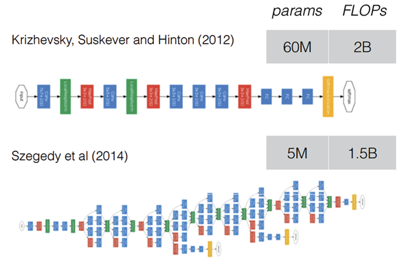

   GoogLeNet은 AlexNet보다 파라미터가 12배나 더 적음에도 불구하고 훨씬 정확했다고 한다. 이러한 개선은 마치 R-CNN처럼 **deep한 구조와 클래식한 컴퓨터 비전의 시너지 덕분이었다.**

- R-CNN이란 ?
    
    R-CNN은 Image classification을 수행하는 CNN과 localization을 위한 regional proposal알고리즘을 연결한 모델이다.
    참고) [https://ganghee-lee.tistory.com/35](https://ganghee-lee.tistory.com/35)
    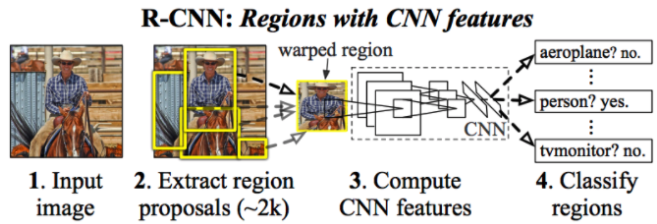
    

  Mobile 및 Embedded 환경에서는 특히 전력 및 메모리 사용량 관점에서 효율적인 알고리즘의 중요성이 대두되고 있기에, 이 논문에서는 모델이 **엄격한 고정된 구조를 가지는 것보다 유연한 구조를 가지게끔** 하였다. 또한 **추론 시간에 1.5 billion 이하의 연산만을 수행하도록 설계**하여, 단순히 학술적인 호기심에 끝나는 것이 아니라 현실에서도 적절히 사용되게끔 설계하였다.

# 3. Related Work

GoogLeNet의 코드네임인 Inception이란 이름은 **Network in Network(NIN)라는 논문에서 유래하였으며,** 더 정확하게는 인셉션 영화의 대사인 "we need to go deeper"에서 착안하였다. 이때 "deep"은 두 가지 의미를 가진다.

1. "Inception module"의 형태로 새로운 차원의 구조 도입

2. 두 번째는 네트워크의 깊이가 증가하였다는 직접적인 의미

LeNet-5를 시작으로 **CNN은 일반적인 표준 구조**를 가지게 되는데, 이는 **Convolutional layer가 쌓이고 그 뒤에 1개 또는 그 이상의 FC layer가 따라오는 구조**이다. 또한 ImageNet과 같이 대용량 데이터에서의 요즘 트렌트는 **layer의 수와 사이즈를 늘리고, 오버 피팅을 해결하기 위해 dropout을 적용**하는 것이다. 따라서 GoogLeNet도 이와 같은 구조를 띤다.

다음으로 Network in Network 논문 내용이 나오게 되는데, 이는 GoogLeNet에 많은 영향을 끼친 논문이다.

먼저 Network in Network는 신경망의 표현력을 높이기 위해 제안된 접근법이다. 이 방법은 **1 x 1 Convolutional layer가 추가되며, ReLU activation이 뒤따른다.** 

 더 깊게 알고싶다면...

- NIN(Network in Network)과 그 이전 모델인 ZFNet에 대해 알아보자
    1. ZFNet
    [https://m.blog.naver.com/laonple/222488895057](https://m.blog.naver.com/laonple/222488895057)
    그간 CNN은 블랙박스 모델, 즉 내부에서 무슨 일이 일어나는지 몰랐다. 하지만 ZFNet은 Visualization(시각화)를 통해 내부에서 무슨 일이 일어나는 지 알게 되었고, 이를 바탕으로 더 좋은 구조로 발전시킬 수 있게 되어 향후 CNN 발전에 토대가 됨.
    2. NIN
    Network in Network에서는 **비선형적 관계를 잘 표현할 수 있도록 단순한 Convolution 연산이 아닌, Multi Layer Perception 즉, MLP를 중간에 넣게 된다.**
        
         [https://m.blog.naver.com/laonple/222504298493](https://m.blog.naver.com/laonple/222504298493)
        
        - MLP Convolutional Layer
            
            
            NIN 연구진들은, 일반적인 CNN 구조의 convolutional layer가 local receptive field에서 어떤 특징을 추출해내는 능력은 우수하지만, 여기에 사용하는 핕터가 선형적(linear)이기 때문에, 비선형적(non-linear)인 특징을 추출해내는 데는 어려움이 있으며, 이 부분을 극복하기 위해 feature-map의 수를 늘려야 한다는 점에 주목했다. 필터의 수를 늘리면 연산량이 늘어나는 문제가 있다.
            
            그래서 NIN 설계진은 local receptive field 안에서 특징을 더 잘 추출해 낼 수 있는 방법을 연구하였으며, 결과로 나온 것이 바로 MLP Convolutional Layer이며, 위 그림과 같은 구조를 가진다.
            
        - CCCP(Cascaded Cross Channel Pooling) 기법 (논문에 적용된 1x1 conv layer와 유사)
            
            Network in Network에서 이용하였던 **CCCP** (Cascaded Cross Channel Pooling)라는 기법이 있다. 이는 하나의 feature map에 대하여 수행하는 일반적인 pooling 기법과는 달리 **channel을 직렬로 묶어 픽셀 별로 pooling을 수행**하는 것인데, 이러한 CCCP 연산의 특징은 **feature map의 크기는 그대로이고, channel의 수만 줄어들게 하여 차원 축소의 효과**를 가져온다.
            
            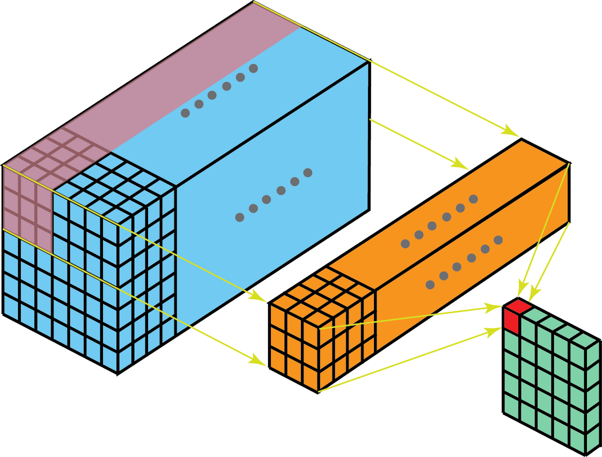
            
            그런데 이 **CCCP 기법은 1 x 1 Convolutional layer과 그 연산 방식 및 효과가 매우 유사**하다. 따라서 GoogLeNet에서 1 x 1 Convolutional layer를 Inception module에 적용한 것이다.
            
            - 1x1의 장점
                
                참고링크) [https://hwiyong.tistory.com/45](https://hwiyong.tistory.com/45)
                
                장점 3가지
                
                1. Channel 수 조절
                2. 연산량 감소(Efficient)
                3. 비선형성(Non-linearity)
                    
                 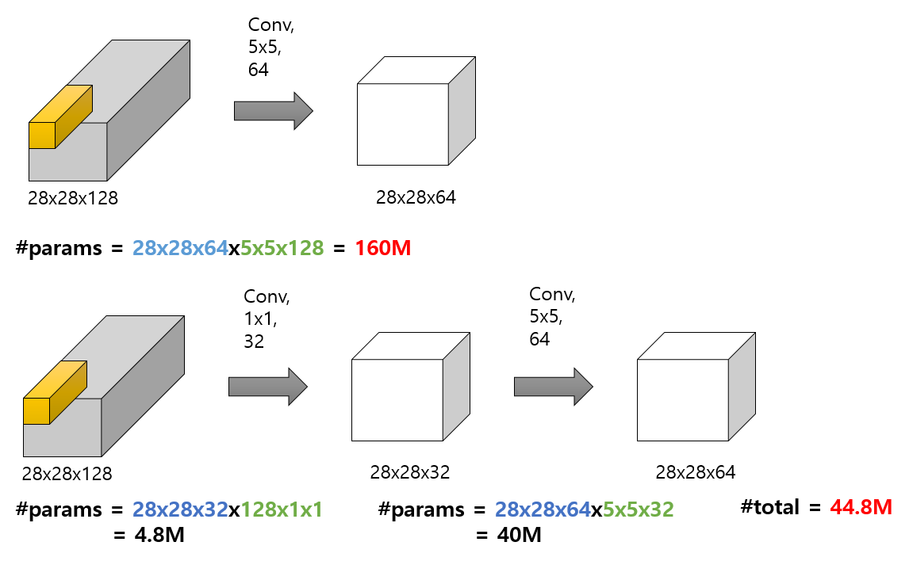
                    
        
    

# **4. Motivation and High Level Considerations**

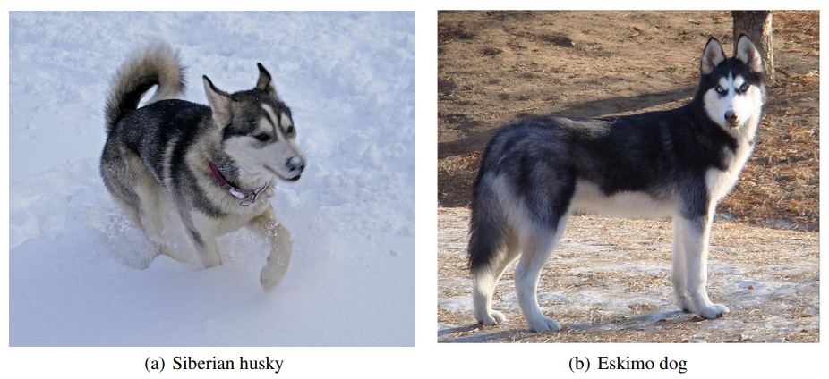

GoogLeNet이 나오게 된 배경에 대해서 설명한다.

**심층 신경망의 성능을 개선시킬 수 있는 가장 간단한 방법은 신경망의 크기를 늘리는 것**이다. 이때, 크기를 늘린다는 것은 다음 두 가지 의미를 뜻한다.

1. **depth의 증가** (level의 수 증가)

2. **width의 증가** (각 level의 유닛 수 증가)

이는 좋은 성능의 모델을 얻을 수 있는 쉽고 안전한 방법이지만, 두 가지 문제점이 있다.

**첫 번째로, 크기가 커진다는 것은 파라미터의 수가 늘어난다는 것인데, 이는 특히 학습 데이터의 수가 적은 경우에 오버 피팅이 일어나기 쉽다.**

이는 **주요한 병목현상**이 될 수도 있는데 ImageNet처럼 세밀한 카테고리를 구별해야 하는 경우, **고품질의 트레이닝 셋을 생성하는 것은 매우 tricky 하며 비용이 높기 때문**이다.

**두 번째로, 네트워크가 커질수록 컴퓨터 자원의 사용량이 늘어난다는 것이다.** 만약 두 Convolutional layer가 연결되어 있다면, **필터의 수가 늘어날 때 연산량을 quadratic 하게 증가**시킬 것이다.

이러한 상황에서 컴퓨팅 자원은 한정적이므로 네트워크의 크기를 늘리는 것보다 컴퓨팅 자원을 효율적으로 분배하는 것이 더욱 중요하다.

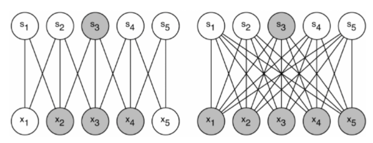
- 왼쪽은 Sparse한 네트워크이고, 오른쪽은 Dense한 네트워크이다

위의 두가지 문제를 모두 해결하기 위한 근본적인 방법은 convolutional layer내부의 fully connected를 sparsely connected 구조로 바꾸는 것이다. 따라서 가장 이상적인 네트워크 구조는 출력의 상관관계를 분석하고 highly correlated된 출력끼리 모은다음 층별로 설계하는 것이다.

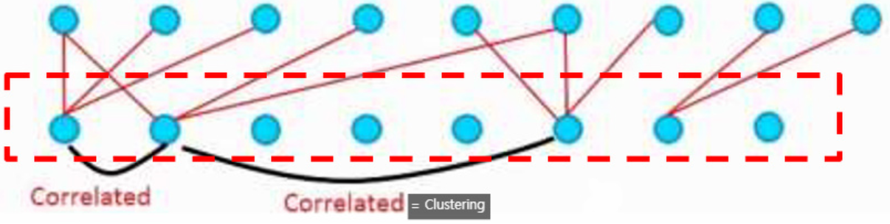

하지만 컴퓨터는 사각이 아닌 sparse matrix계산을 효율적으로 수행하지 못한다. vision 분야의 머신러닝 시스템들은 convolutuion을 이용해서 spatial domain에서는 sparsity를 이용하는듯 하지만, convolution자체가 dense connections의 모음으로 구현된다.

> 너무 어려워서,,, 부연설명,, 도 어렵습니다
> 
> 
> convolution은 실제 시신경에서 특정 패턴에 특정뉴런이 반응하는 것을 본따서 만들었다. 즉 필터는 특정 뉴런이고, 입력 이미지의 패턴에 일부 필터만 반응하므로(값이 크므로) sparsity를 이용한다고 말 했거나, convolution자체가 patch의 한 픽셀당 각 필터 전체가 아닌 한 픽셀과만 곱해지므로 sparsity하다고 말한 것 같다.
> 
> dense connection 부분은 실제구현에서 conv layer의 입력은 3차원이나 4차원이라 계산이 비효율적이다. 따라서, 효율성을 위해 이를 2차원으로 변환후 행렬 내적으로 구현하는데, 행렬 내적은 dense connection이므로 convolutuion은 dense connection으로 구현된다고 말한 것으로 보인다.
> 

ConvNet은 LeNet이후로 symmetry를 깨고 학습을 향상시키기 위해서 feature 차원에서의 random 혹은 sparse connection table을 사용 했다. 하지만, 병렬 계산을 더 최적화하기 위해 AlexNet의 full connection으로 바뀌었다.

Inception 구조는 어떻게 filter-level과 같은 단계에서 sparsely connected 구조를 만들까에서 시작되었다.

# **5. Architectural Details**

이제 본격적으로 Inception 구조에 대해 자세히 설명한다.

**Inception 구조의 주요 아이디어는 CNN에서 각 요소를 최적의 local sparce structure로 근사화하고, 이를 dense component로 바꾸는 방법을 찾는 것**이다. 즉, 최적의 local 구성 요소를 찾고 이를 공간적으로 반복하면 된다. 이를 쉽게 말하자면 **Sparse 매트릭스를 서로 묶어 (클러스터링 하여) 상대적으로 Dense 한 Submatrix를 만든다는 것**이다.

이때, 이전 layer의 각 유닛이 입력 이미지의 특정 부분에 해당된다고 가정하였는데, 입력 이미지와 가까운 낮은 layer에서는 특정 부분에 Correlated unit들이 집중되어 있다. 이는 단일 지역에 많은 클러스터들이 집중된다는 뜻이기에 1 x 1 Convolution으로 처리할 수 있다.

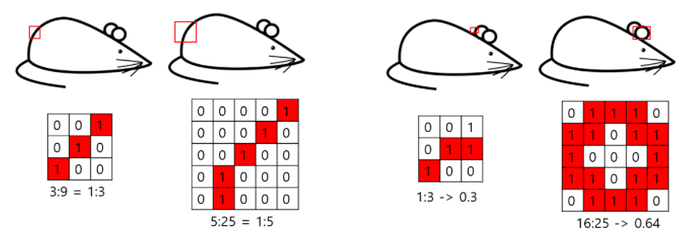

맨 오른쪽의 원형 모양은 필터가 더 커야 연관된 유닛을 더욱 많이 뽑아낼 수 있다.

하지만, 몇몇 위치에서는 위 그림에서처럼 **좀 더 넓은 영역의 Convolutional filter가 있어야 Correlated unit의 비율을 높일 수 있는 상황**이 나타날 수도 있다. 따라서 **feature map을 효과적으로 추출할 수 있도록 1 x 1, 3 x 3, 5 x 5 convolution 연산을 병렬적으로 수행**한다.

또한 CNN에서 pooling layer의 성능은 이미 입증되었으므로 이와 함께 높이와 폭을 맞추기 위해 padding도 추가해준다.

> padding이란? 
크기를 유지하기 위해 matrix 외각을 빙 둘러서 1~2 픽셀 정도를 더 크게 만드는 것 
[https://brunch.co.kr/@coolmindory/37](https://brunch.co.kr/@coolmindory/37)
> 

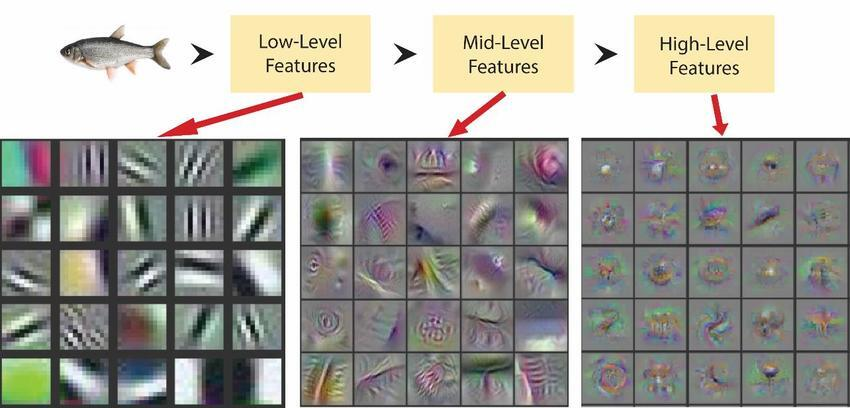

1 x 1, 3 x 3, 5 x 5 Convolutional filter의 수는 망이 깊어짐에 따라 달라지는데, 만약 위 그림처럼 높은 layer에서만 포착될 수 있는 높은 추상적 개념의 특징이 있다면, 공간적 집중도가 감소하게 되어, 네트워크가 깊어짐에 따라 3 x 3과 5 x 5 Convolutional filter의 수도 늘어나야 한다.

**그런데 여기서 큰 문제가 발생한다!**

3 x 3 Convolutional filter 뿐만 아니라, 5 x 5 Convolutional filter도 사용할 경우, 연산량이 많아지는데 입력 feature map의 크기가 크거나 5 x 5 Convolutional filter의 수가 많아지면 **연산량은 더욱 증가하게 된다.**

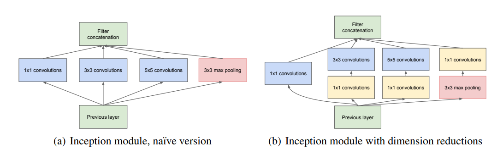

연산량 문제를 해결하기 위해 왼쪽 모델에서 1 x 1 Convolution layer를 추가하였다

따라서 이 문제를 해결하기 위해 **1 x 1 Convolutional filter를 이용하여 차원을 축소**하였다. **3 x 3과 5 x 5 앞에 1 x 1을 두어 차원을 줄이는데, 이를 통해 여러 Scale을 확보하면서도 연산량을 낮출 수 있다.**

추가적으로, **Convlution 연산 이후에 추가되는 ReLU를 통해 비선형적 특징을 더 추가**할 수 있다.

또한, Google 팀에서는 **효율적인 메모리 사용을 위해 낮은 layer에서는 기본적인 CNN 모델을 적용**하고, **높은 layer에서 Inception module을 사용**하는 것이 좋다고 한다.

이러한 특징들을 가진 Inception module을 사용하면 다음 두 가지 효과를 볼 수 있다.

1. **과도한 연산량 문제없이 각 단계에서 유닛 수를 상당히 증가**시킬 수 있다. 이는 차원 축소를 통해 다음 layer의 input 수를 조절할 수 있기 때문이다.

2. **Visual 정보가 다양한 Scale로 처리되고, 다음 layer는 동시에 서로 다른 layer에서 특징을 추출**할 수 있다. 1 x 1, 3 x 3, 5 x 5 Convolution 연산을 통해 다양한 특징을 추출할 수 있기 때문이다.

# 6. GoogleNet

이제 Inception module이 적용된 전체 GoogLeNet의 구조에 대해서 알아본다.

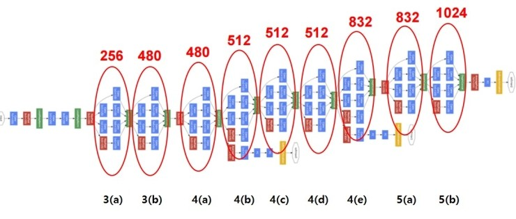

먼저, GoogLeNet이라는 이름은 LeNet으로부터 유래하였으며, 이는 Inception 구조의 성체라고 한다.

**Inception module 내부를 포함한 모든 Convolution layer에는 ReLU가 적용**되어 있다. 또한 receptive field의 크기는 224 x 224로 RGB 컬러 채널을 가지며, mean subtraction을 적용한다.

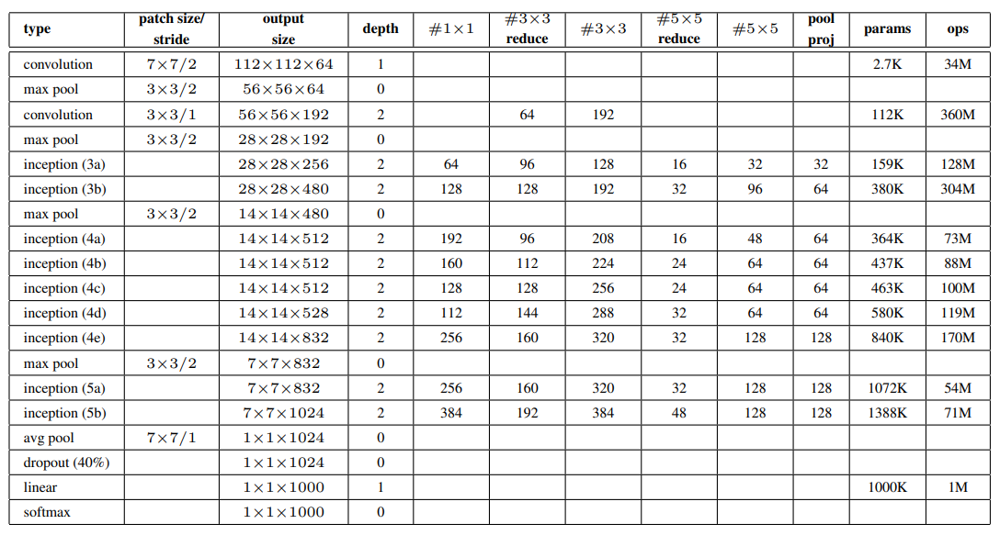

GoogLeNet의 세부 구성

- 표 설명 링크) [https://m.blog.naver.com/PostView.naver?blogId=laonple&logNo=222518300329&referrerCode=0&searchKeyword=googlenet](https://m.blog.naver.com/PostView.naver?blogId=laonple&logNo=222518300329&referrerCode=0&searchKeyword=googlenet)
    - Patch size/stride: 커널의 크기와 stride 간격. 예를 들어, 최초의 convolution에 있는 7x7/2의 의미는 receptive field의 크기가 7x7인 filter를 2픽셀 간격(stride)으로 적용한다는 뜻이다.
    - Output size: 얻어지는 feature-map의 크기 및 개수. 112x112x64의 의미는 224x224 크기의 이미지에 2픽셀 간격으로 7x7 filter를 적용하여 총 64개의 feature-map이 얻어졌다는 뜻이다.
    - Depth: 연속으로 convolution layer의 개수. 첫번째 convolution layer는 depth가 1이고, 두번째와 인셉션이 적용되어 있는 부분은 모두 2로 되어 있는 이유는 2개의 convolution을 연속적으로 적용하기 때문이다.
    - #1x1: 1x1 convolution을 의미. 그 행에 있는 숫자는 1x1 convolution을 수행한 뒤 얻어지는 feature-map의 개수를 말한다. 첫번째 인셉션 3(a)의 #1x1 위치에 있는 숫자가 64인데 이것은 이전 layer의 192개 feature-map을 입력으로 받아 64개의 feature-map이 얻어졌다는 뜻이다. 즉, 192차원이 64차원으로 줄어들게 된다.
    - #3x3 reduce: 3x3 convolution 앞쪽에 있는 1x1 convolution 을 의미. 인셉션 3(a)의 수를 보면 96이 있는데, 이것은 3x3 convolution을 수행하기 전에 192차원을 96차원으로 줄인 것을 의미한다.
    - #3x3: 1x1 convolution에 의해 차원이 줄어든 feature map에 연결되는 3x3 convolution. 인셉션 3(a)의 숫자 128은 최종적으로 1x1 convolution과 3x3 convolution을 연속으로 적용하여 128개의 feature-map이 얻어졌다는 뜻이다.
    - #5x5 reduce: 해석 방법은 “#3x3 reduce”와 동일하다.
    - #5x5: 해석 방법은 “#3x3”과 동일하다. #5x5는 좀 더 넓은 영역에 걸쳐 있는 feature를 추출하기 위한 용도로 인셉션 모듈에 적용이 되었다.
    - Pool/proj: max-pooling과 max-pooling 뒤에 오는 1x1 convolution을 적용한 것을 의미. 인셉션 3(a) 열의 숫자 32 는 max-pooling과 1x1 convolution을 거쳐 총 32개의 feature-map이 얻어졌다는 뜻이다.
    - Params: 해당 layer에 있는 free parameter의 개수. 입출력 feature-map의 數에 비례한다. 인셉션 3(a) 열에 있는 숫자 159K는 총 256개의 feature-map을 만들기 위해 159K의 free-parameter가 적용되었다는 뜻이다.
    - Ops: 연산의 수. 연산의 수는 feature-map의 수와 입출력 feature-map의 크기에 비례한다. 인셉션 3(a)의 단계에서는 총 128M의 연산을 수행한다.

GoogLeNet을 4가지 부분으로 나누어 살펴보자면 다음과 같다.

**Part 1**

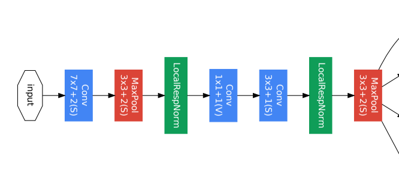

낮은 레이어가 위치해 있는 부분

Part 1은 **입력 이미지와 가까운 낮은 레이어가 위치해 있는 부분**이다.

이는 위에서 설명했듯이 **효율적인 메모리 사용을 위해 낮은 layer에서는 기본적인 CNN 모델을 적용**하고, 높은 layer에서 Inception module을 사용하라고 하였기에 Inception module이 사용되지 않은 것을 볼 수 있다.

**Part 2**

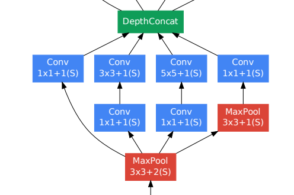

Part 2는 **Inception module**로서 **다양한 특징을 추출하기 위해 1 x 1, 3 x 3, 5 x 5 Convolutional layer가 병렬적으로 연산을 수행**하고 있으며, **차원을 축소하여 연산량을 줄이기 위해 1 x 1 Convolutional layer가 적용**되어 있는 것을 확인할 수 있다.

**Part 3**

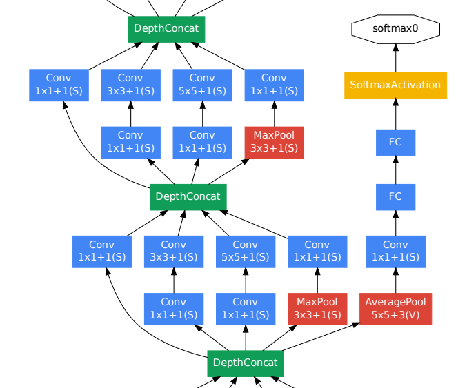

Part 3는 **auxiliary classifier가 적용된 부분**이다.

모델의 **깊이가 매우 깊을 경우, 기울기가 0으로 수렴하는 gradient vanishing 문제가 발생**할 수 있다. 이때, 상대적으로 얕은 신경망의 강한 성능을 통해 신경망의 중간 layer에서 생성된 특징이 매우 차별적이라는 것을 알 수 있다. 따라서 **중간 layer에 auxiliary classifier를 추가하여, 중간중간에 결과를 출력해 추가적인 역전파를 일으켜 gradient가 전달될** 수 있게끔 하면서도 **정규화 효과**가 나타나도록 하였다.

추가로, 지나치게 영향을 주는 것을 막기 위해 **auxiliary classifier의 loss에 0.3을 곱**하였고, **실제 테스트 시에는 auxiliary classifier를 제거** 후, 제일 끝단의 softmax만을 사용하였다.

**Part 4**

Part 4는 **예측 결과가 나오는 모델의 끝 부분**이다.

여기서 **최종 Classifier 이전에 average pooling layer를 사용**하고 있는데 이는 **GAP** (Global Average Pooling)가 적용된 것으로 **이전 layer에서 추출된 feature map을 각각 평균 낸 것을 이어 1차원 벡터로 만들어 준다.** 이는 1차원 벡터로 만들어줘야 최종적으로 이미지 분류를 위한 softmax layer와 연결할 수 있기 때문이다.

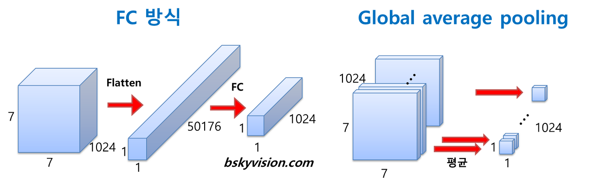

이렇게 **평균하여 1차원 벡터로 만들면 가중치의 개수를 상당히 많이 줄여주며,** 또한 GAP를 적용할 시, **tuning**을 하기 쉽게 만든다.

**7. Training Methodology**

여기서는 모델 훈련을 어떻게 하였는지에 대해 설명하고 있다.

Google 팀에서는 **0.9 momentum의 Stochastic gradient descent**를 이용하였고, **learning rate는 8 epochs 마다 4%씩 감소**시켰다.

> Momentum
가속도를 이용한  weight optimization 방법
[https://light-tree.tistory.com/140](https://light-tree.tistory.com/140)
> 

또한, 이미지의 **가로, 세로 비율을 3 : 4와 4 : 3 사이로 유지하며 본래 사이즈의 8% ~ 100%가 포함되도록 다양한 크기의 patch를 사용**하였다. 그리고 **photometric distortions**를 통해 학습 데이터를 늘렸다고 한다.

**8. Conclusions**

**Inception 구조는 Sparse 구조를 Dense 구조로 근사화하여 성능을 개선**하였다. 이는 기존에 CNN 성능을 높이기 위한 방법과는 다른 **새로운 방법**이었으며, **성능은 대폭 상승하지만 연산량은 약간만 증가**한다는 장점이 있다.

- 3줄요약

모바일과 임베디드 상에서 잘 작동하기 위해 **컴퓨팅 자원을 효율적으로 활용해야 한다는 요구**가 높아졌다.

차원 축소를 통한 **계산양 감소**와 **비선형성 추가** 두 가지를 목적으로 **인셉션 모듈을 도입**했다.

인셉션 모듈을 통해 **컴퓨팅 비용은 적게 상승**하지만, **더 깊고 넓으면서 성능도 좋은 GoogLeNet을 구축**했다.

