# DQN-2013 Summary

먼저, Atari 란, 미국의 비디오 게임 회사입니다.

그리고 본 논문에서는 Atari회사의 게임을 사용해 강화학습을 적용하였습니다. 대표적인 Atari 게임 종류에는 다음과 같은 익숙한 고전 게임들이 많습니다.

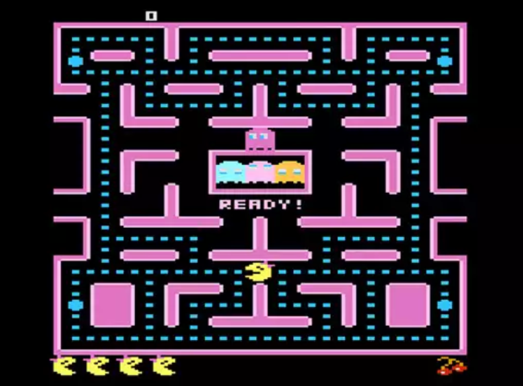

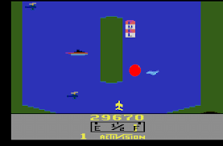

다양한 Atari게임 중, 본 논문에서 사용된 게임의 예시는 다음과 같습니다.

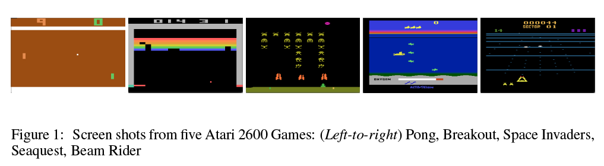

## Abstract

- High-Dimensional Sensory Input으로부터 Reinforcement Learning을 통해 Control Policy를 성공적으로 학습하는 Deep Learning Model
- 이 모델은 Atari는 CNN 모델을 사용하며, 변형된 Q-learning을 사용하여 학습되었습니다.
- 여기서 Q-learning이란 input이 raw pixels이고, output은 미래의 보상을 예측하는 value function입니다.
- 실제로 게임을 학습할 때, 스크린의 픽셀값들을 입력으로 받고, 각 행위에 대해 점수를 부여하고, 어떤 행동에 대한 결과값을 함수를 통해 받게 됩니다.
- Atari는 2600개가 넘는 다양한 게임을 학습시키는데 동일한 모델과 학습 알고리즘을 사용하였고, 성공적인 결과를 보였습니다.

## Introduction

최근 딥러닝의 발전으로 컴퓨터 비전과 음성인식의 획기적인 발전을 이끌었습니다. 이러한 방법은 CNN, 다층 퍼셉트론, **restricted Boltzman machines** 그리고 순환신경망을 포함한 광범위한 신경망 아키텍쳐를 활용하며, 지도학습과 비지도 학습을 모두 활용합니다. 

- restricted Boltzman machines
    
    일련의 입력 데이터에 대한 확률 분포를 배울 수 있는 생성 확률론적 인공신경망. 즉, 확률 분포를 학습하기 위해 만들어진 알고리즘이라고 이해하시면 됩니다. 
    

그러나, 딥러닝 관점에서 강화학습은 몇 개의 문제점이 있습니다.

1) 딥러닝은 많은 양의 라벨링 된 훈련 데이터를 필요로 합니다.

- RL 알고리즘은 Sparse하고, noise가 많고 딜레이가 있는 센서 데이터에서 학습할 수 있어야 합니다. (즉, 라벨링이 쉽지 않습니다!)

2) 딥러닝 알고리즘은 데이터가 독립적이라고 가정하지만, RL에서는 데이터가 높은 상관성을 갖습니다.

3) RL에서는 알고리즘이 새로운 동작을 학습함에 따라 데이터 분포가 변경되는 반면, 딥러닝 방법에서는 데이터 분포는 고정된 것으로 간주합니다.

→ 하지만, 이 논문에서는 CNN이 복잡한 RL 환경의 비디오 데이터로부터 성공적인 Policy를 학습하기 위해 이러한 과제를 극복할 수 있습니다 😃

**어떻게?** 

CNN의 가중치를 업데이트하기 위해 확률적 경사하강법과 함께 변형된 Q- learning알고리즘으로 훈련됩니다.

또한, 2)와 3)의 문제를 해결하기 위해 Experience Replay Memory를 사용하는데, 이는 무작위로 이전의 *Transition*을 추출해 training distribution을 완화시킵니다.

**Trainsition : 전이/ 이전 상태로 번역하며, $p(s_{t+1} | s_t, a_t)$ 수식으로 표현합니다. 이는 t상태에서, action이 주어졌을 때 (t+1)상태의 보상확률을 나타낸 것으로 Environment에서 주어진 것으로 파악합니다. (이전 포스팅 참고.)*

**목표**

하나의 신경망을 만들어 가능한 많은 게임을 학습시키기. 

이때, 게임에 대한 특정 정보, 데이터 제공 X

## Background

- Agent가 타임스텝마다 할 수 있는 행동 $A={1, ... , K}$ 중에서 한가지($a_t$)를 선택합니다.
- 입력이미지를 바탕으로 어떤 행동($a_t$)을 통해 보상($r_t$)를 받고 상태(s)를 갱신합니다.
- 현재의 행동이 미래에 영향을 받으므로 행동시퀀스 $s_t= x_1, a_1, x_2, a_2, ... , a_{t-1}, x_t$를 통해 학습을 진행하며 미래 보상을 최대화 하는 행동을 선택하도록 학습합니다.

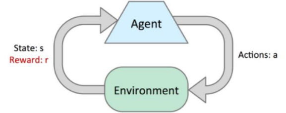

- 시간 t에서 Discount Factor($\gamma$) 가 적용된 보상($r_t$)는 다음과 같습니다.
    
    $r_t = \sum_{t'=t}^{T} \gamma ^{t'-t} r_{t'}$ 
    
    ex) $r_3 = r_3 + \gamma ^1 r_4 + \gamma^2 r_5 + ... + \gamma^{T-3} r_T$
    
- 새로 정의한 행동가치 함수 $Q^*(s,a)$ 즉, policy $\pi$를 통해 얻을 수 있는 보상의 최대 기대값을 구합니다.
    - $Q^*(s,a) = max_\pi E[R_t | s_t=s, a_t=a, \pi]$
- **Bellman Equation**에 따라, 모든 가능한 a’에 대해 다음 시간 스텝에서 최적의 $Q^*(s,a)$ 를 안다면, 최적 전략은 $r+\gamma * Q^*(s,a)$를 최대화하는 것입니다.
    - Bellman Equation (with derivation)
        
        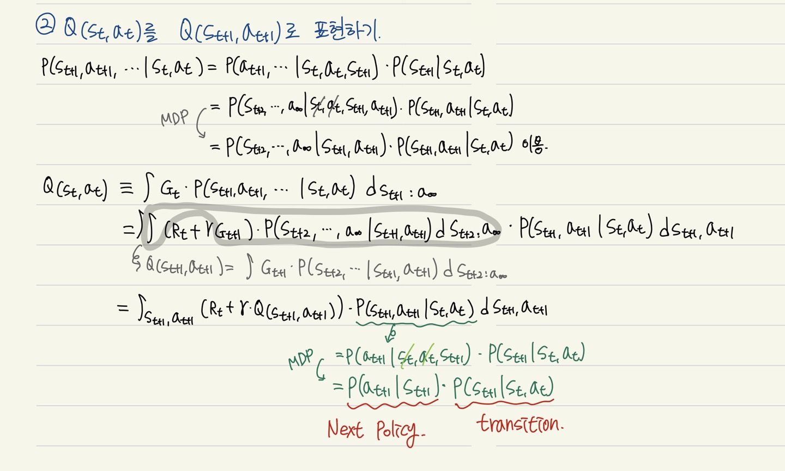
        
        → 여기서, 다음스텝에서의 최적의 $Q^*(s,a)$는 마지막 식의 $Q(s_{t+1}, a_{t+1})$이라고 생각하면 됩니다!
        
- 따라서, RL은 i가 무한대로 근사함에 따라, $Q_i$를 $Q^*$에 근사시키는 Optimal 전략을 사용합니다.
    
    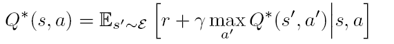
    

- 하지만! 이러한 Action Value function은 각 시퀀스에 대해 독립적으로 추정됩니다. (비현실적)
- $\theta$를 가중치로 갖는 비선형 네트워크 함수 근사치를 통해 최적의 행동 가치함수의 근사치를 구합니다.
    
    $Q(s,a ; \theta) \approx Q^*(s,a)$
    
- $\theta$를 학습시키기 위해 i번째 iteration에서 loss function을 정의하여 $\theta$가 수렴할 때 까지 반복합니다.
    
    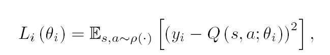
    
    - 이때, $y_i$는 iteration의 타겟값입니다. → 앞서 정의한 $Q^*(s,a)$가 됩니다!
- 결과적으로 얻게되는 Gradient는 다음과 같습니다.
    
    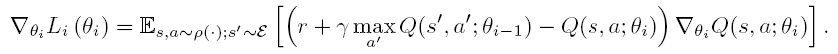
    

## Related Work

강화학습의 성공사례 : TD- Gammon

- 강화학습과 self-play를 함으로써, 완전히 학습이 되는 backgammon playing 방식
- 인간을 뛰어넘는 플레이 보임.
- Q-learning과 같이 model-free 강화학습 알고리즘 사용되었고 하나의 hidden layer을 갖는 다층퍼셉트론을 사용해 **value function**을 근사.
- 초기에는 좋은 성공을 나타냈지만, 이후 체스와 바둑 등에 대해서는 성공적이지 못했습니다. 😢
- Value function
    
    보상(reward)를 표현하는 함수식. 현재 상태에 대한 가치를 나타내는 **상태가치 함수**와 행동에 대한 가치를 나타내는 **행동가치 함수**가 있음.
    

- 본 논문에서는 Model-free 강화학습 알고리즘을 사용하였습니다.
- 또한, Learning Policy와 Behavior Policy가 다른 Off-Policy를 사용하였습니다.

## Deep Reinforcement Learning

본 연구의 목표는 강화학습 알고리즘을 deep neural network에 연결하는 것입니다. 

선행 연구인 TD-Gammon architecture에서 영감을 받아 진행되었습니다. TD-Gammin은 1982년에 개발된 주사위 놀이 프로그램입니다. 이 이름은 시간차 학습의 형태, 훈련된 인공 신경망이라는 사실에서 비롯되었습니다.

선행 연구와의 차이점으로는 Experience Replay가 있습니다. Experience Replay는 agenet의 experience를 각 time-step마다 저장하는 것을 말합니다. experience samples에 Q-Learning과 mini-batch update를 적용하고 experience replay를 수행한 후 agent는 greedy policy에 따라 action을 선택하고 수행합니다.

이 방법은 online Q-Learning보다 이점을 지니고 있습니다. 첫번째로는 각 step의 experience를 weight update에 사용할 수 있어 데이터를 효율적으로 사용할 수 있습니다. 다음으로는 표본을 랜덤하게 추출함으로써 weight update의 분산을 줄어들게 합니다. 마지막으로 experience replay를 사용함으로써 behavior distribution이 평등해져 학습을 안정적으로 만들 수 있습니다.

experience replay로 학습하기 위해서는 현재의 파라미터와 sample을 generate하는데 사용하는 파라미터가 다르기 때문에 off-policy를 학습하는 것이 필수적입니다.

**<Deep Q-Learning with Experience Replay’s Algorithm>**

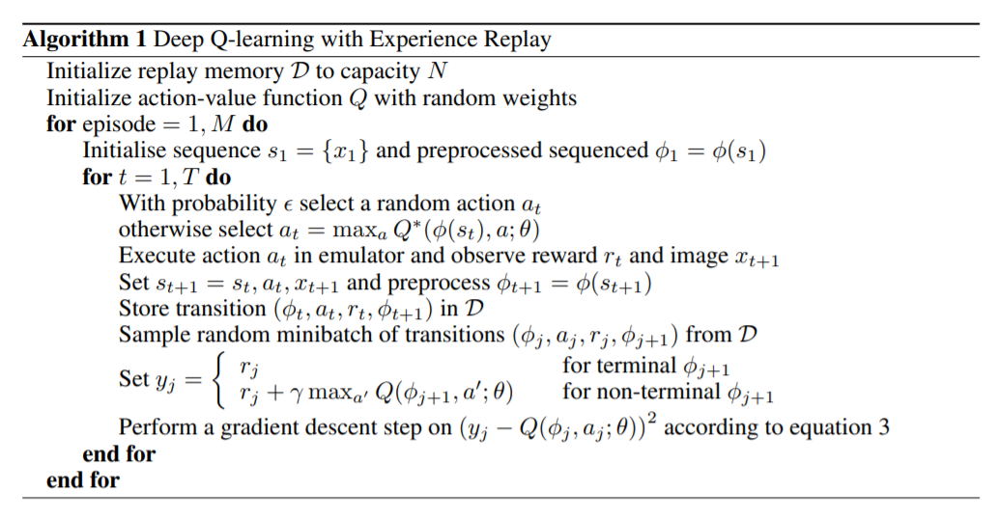

1) 변수 초기화

- replay memory D 초기화(D의 메모리 용량 : N)
- action-value function Q 초기화 → random한 weight를 지니도록 초기화

2) 반복문 : 에피소드별 반복 학습(학습 횟수)

- sequence 초기화 : s1={x1}
- sequence 전처리

3) 반복문 : 한개의 에피소드 안에서 시간에 따라 반복

- $\epsilon$의 확률로 랜덤한 action a_t 선택
- a_t 선택의 기준 : Q-value를 최대화 시키는 a_t
- a_t를 emulator에서 실행하고 reward r_td와 다음 이미지 x_t+1 관찰
- sequence 정의 : s_t+1=s_t, a_t, x_t+1
- sequence를 전처리하고 replay memory D에 저장
- D로 부터 transition을 minibatch 형태로 랜덤하게 추출
- 정답 y_j 값과 DQN의 판단값의 차이를 이용하여 SGD로 DQN을 최적화

## Preprocessing and Model Architecture

1) Preprocessing

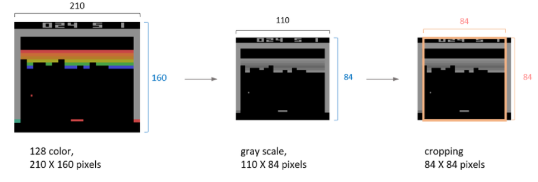

- Atari 게임의 이미지 크기 : 210*160
- 210*160 → 110*84로 줄임 / gray-scale로 변경(채널 수 3 →1)
- 실질적으로 게임이 이루어지는 영역으로 84*84 사이즈 만큼 crop함

2) Model Architecture(DQN)

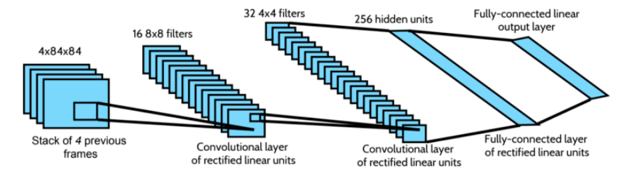

- DQN은 state representation만을 network의 input으로 사용함
- output은 input state에 대한 개별 action의 예측한 Q-value에 해당함
- 모델 구조는 주어진 state에 대해 가능한 모든 action의 Q-value를 계산 가능함 (single forward pass를 통해)

## Experiments

Experiment를 진행하기 위해서는 algorithm 및 hyper-parameter에 대한 3가지 setting이 필요합니다.

1) Reward Structure

양의 보상은 1, 음의 보상은 -1, 그리고 변화 없음은 0으로 함으로써 error derivatives(오류 도함수)의 스케일을 제한하고 모든 게임에 동일한 learning rate를 적용할 수 있습니다.

2) RMSProp Algorithm & $\epsilon$

크기 32의 Minibatch을 RMSProp 알고리즘에 적용하고 Behavior Policy로는 처음부터 100만번째 프레임까지는 1에서 0.1까지 동일한 비율로 감소하는 $\epsilon$ 값을 통해 e-greedy 알고리즘을 사용하였습니다.

3) Frame Skipping Technique

Agent가 모든 Frame을 보고 Action을 취하는 것이 아니라 K번째 프레임을 보고 액션을 고르게 하였고, 마지막 행동은 skipped된 frames에 반복 적용함으로써 필요한 계산을 줄였습니다.

**Training and Stability**

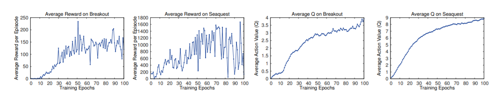

- 10,000 step 동안 $\epsilon=0.05$을 적용하여 계산된 value
- 1 epoch는 50,000 minibatch의 weight 업데이터 혹은 약 30분의 학습 시간을 의미
- 학습이 진행됨에 따라 reward와 action value가 증가함

**Visualizing the Value Function**

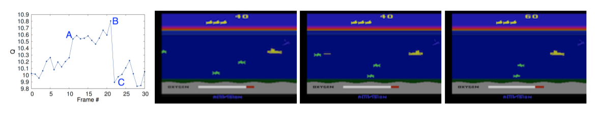

**Main Evaluation**

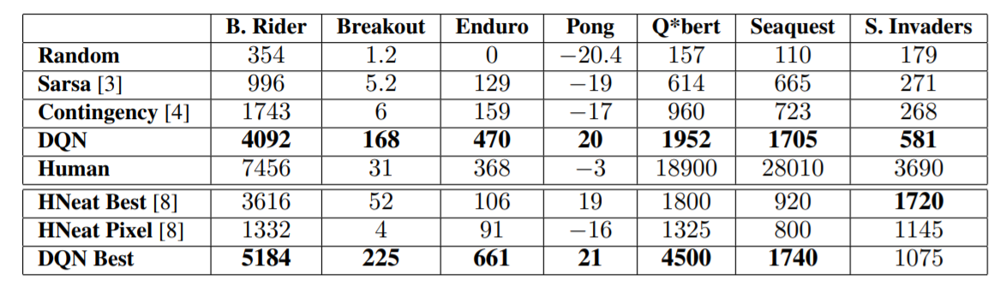

## Conclusion

- Reinforcemnet learing을 위한 새로운 deep learning model을 소개
- input으로 raw pixels을 사용하며, Atari 2600 컴퓨터 게임에서 테스트를 진행
- experience replay memory로 mini-batch 방식을 사용하는 변형된 online Q-learning을 제안
- 아키텍쳐나 하이퍼 파라미터의 조정 없이, 7개의 아타리 게임에서 모두 최고의 성능을 발휘함
