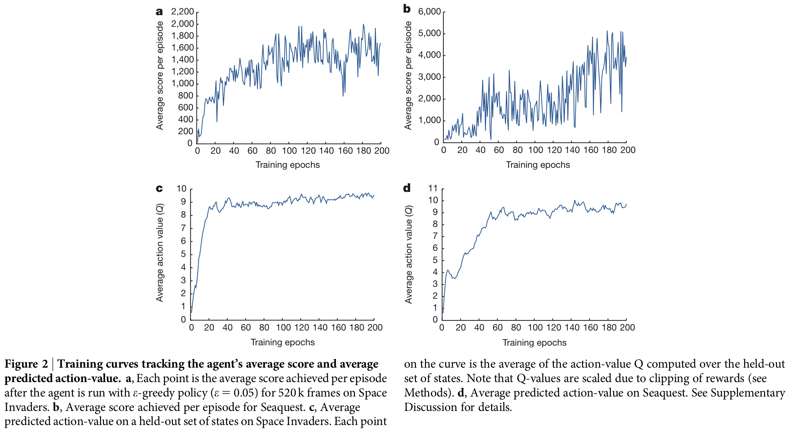

# DQN - 2015 Summary

# Introduction

강화학습은 몇 몇 도메인에 대해서만 성공적이었다. 

ex) 수작업으로 유용한 features를 만들어 낼 수 있는 도메인, 완벽하게 관측되는 도메인, 저차원의 상태를 갖는 도메인

최근 발전하고 있는 deep neural networks의 학습을 사용해 deep Q-Network라고 부르는 최신 artifitial agent를 개발했다. 이는 고차원 sensory input에서 성공적으로 학습할 수 있다.

Atari 2600 games에 대해 Test: 오직 픽셀과 게임스코어를 input으로 받으면서, deep Q-Network agent가 이전의 모든 알고리즘의 성능보다 좋았다.

# Key Idea

### Problems

deep neural network라고 알려진 인공신경망과 강화학습을 합쳐 deep Q-network(DQN)이라는 새로운 agent를 개발했다. 즉, deep neural network의 최근 발전은 raw sensory data에서 직접 물체 카테고리와 같은 개념들을 학습할 수 있게 했다. deep convolutional network라는 특히 성공적인 architecture을 사용한다. 따라서, 이미지에 나타나는 local sparial correlations를 이용하고, viewpoint 또는 scale의 변화와 같은 변환에 대해 강건성을 구축한다.

- 강건성 (robustness)
    
    이상치에 영향을 덜 받는 모델의 견고성
    

observations(*State라고 생각하시면 됩니다.*), Action, Reward의 시퀀스를 통해 agent와 environment이 상호작용하는 상황을 고려한다. 

goal: 미래 보상에 대한 계산식을 최대로 하는 action 고르기

$Q^*(s,a) = max_\pi E[r_t + \gamma r_{t+1}+ \gamma^2 r_{t+2}+ ... | s_t=s, a_t=a, \pi]$

즉, Observation(s) 와 Action(a) 를 하고나서, 각 time (t)에서 $\gamma$에 의해 줄어든 보상 $r_t$의 합을 최대화 하는 것. 이는 behavior policy $\pi = P(a|s)$에 의해 달성 될 수 있다.

강화학습은 신경망과 같은 비선형 함수 approximator가 Action- Value Function ($Q$)를 나타내기 위해 사용될 때, 불안정하거나, 심지어는 발산한다고 알려져 있다.

- 불안정성의 원인은?
    
    아주 약간의 정도로 $Q$ 함수를 업데이트 하는 것은 policy를 아주 많이 변화시켜 데이터 분포를 바꿀 지도 모른다는 사실에 기반함
    
    1) observation(state) 시퀀스에서 나타난 상관관계
    
    2) Action-value function $Q$ 와 target values $r + \gamma * max_{a'} Q(s',a')$ 사이의 상관관계 : 즉, target value가 Q함수에 대해 의존적이다. 아래 loss 식을 통해 자기 자신이 target 됨으로써 학습이 매우 불안정적이게 된다.
    
    
    

### Solutions

두 가지 기본 아이디어를 사용해 Q-learning의 새로운 변형으로 이 불안정성을 해결한다.

1. **experience replay**

observation 시퀀스에서의 상관관계를 제거하고, 데이터 분포 변화를 적게하기 위해서 시행. 

데이터 셋 $D_t=\{e_1, ..., e_t\}$내  시간 t 각각에 대해 agent 의 experience를  $e_t=(s_t, a_t, r_t,s_{t+1})$로 저장한다.  $(s,a,r,s') \sim U(D)$를 따르는 Uniform Random Sampling을 통해 얻은 샘플들에 대해서 우리는 Q-learning 업데이트를 사용한다. 샘플 (minibatch)이 순차적인 데이터(시퀀스)로 구성되지 않기 때문에 데이터 간의 상관관계를 줄일 수 있다. 

1. **Fixed Q- targets**

target value가 Action-value function에 의존적인 문제를 해결하기 위해 사용. 

target value에서의 네트워크 Q는 Action-value function과 같은 네트워크 구조이지만, 파라미터를 다르게 하여 Action-value function과 독립적인 구조를 만든다. 즉, target network $Q(s',a' ; \theta_i^-)$

1과 2를 활용한 Q-learning의 loss function은 다음과 같다.

$L_i(\theta_i) = E_{(s,a,r,s')\sim U(D)} [(r+\gamma * max_{a'}Q(s',a';\theta_i^-)-Q(s,a;\theta))^2]$

- 변수설명
    
    $\gamma$: discount factor
    
    $\theta_i$: 이터레이션 i에서 Q-network의 파라미터
    
    $\theta_i^-$: 이터레이션 i에서 타겟을 계산하기 위한 네트워크 파라미터
    
    - $\theta_i^-$는 매 C 스텝마다 Q-network parameter ($\theta_i$)로 업데이트 된다. 즉, C번의 iteraction동안에는 Q-learning update시 target이 움직이는 현상을 방지할 수 있다.

# Algorithm & Architecture

### Algorithm

- 이전 포스팅 (Playing Atari with Deep Reinforcement learning 논문, 2013)과 비슷한 듯 싶지만, 가장 큰 차이는 target value에 있습니다.
- 2013년의 DQN은 target value를 상수 취급을 하여 강화학습을 진행하였지만, 2015년에 새로 publish된 DQN은 target value를 네트워크로 구성해 performance를 향상시켰습니다.
- 2013 DQN Algorithm
    
    
    

### Architecture

- input : 84*84*4 (by preprocessing map $\emptyset$ )
    - preprocessing
        1. 이미지 크기 변환 (210,160) → (84,84)
        2. RGB 이미지를 grayscale로 변환
        3. 연속된 이미지 중 매 k번째 위치한 이미지들만 선택 (Skipped frame)
        4. 3번에서 선택된 이미지와 그 앞에 위치한 이미지에 대해 pixel-wise maximum을 취해준다. 
        5. 모든 과정을 거친 이미지들을 m개 만큼 쌓으면 네트워크의 입력으로 사용될 수 있는 하나의 상태가 된다.
        - pixel-wise maximum
            
            Atari 2600은 화면에 한번에 표시할 수 있는 스프라이트 이미지가 5개 뿐이어서 짝수 프레임, 홀수 프레임 번갈아 표시해 여러개의 이미지를 화면에 보여줄 수 있었다. pixel-wise maximum(component wise maximum)을 취해줌으로써 이를 한 이미지에 모두 표시할 수 있다.
            
- Stride 4, 8*8필터를 사용해 32 Convolution 진행
- Stride 2, 4*4필터를 사용해 64 Convolution 진행
- Stride 1, 3*3필터를 사용해 64 Convolution 진행
- 512개의 노드들 Fully connected layer
- Fully Connected linear layer

# Traing

1. **Reward**

게임마다 점수의 단위가 매우 다르기 때문에 모든 positive reward에 대해서는 1, negative reward에 -1, unchanged reward에 대해서는 0으로 값을 clipping한다. 여러 게임에 대해 같은 learning rate로 학습하는 것을 가능하게 할 수 있다.

1. **Episode**

Atari 2600 emulator를 통해 life counter을 전달받을 수 있는데, 이는 학습과정에서 episode의 끝을 표시하기 위해 사용된다.

1. **Epsilon**

Behaviour policy는 epsilon-greedy 방식이다. epsilon값은 1.0으로 시작해 처음 백만 프레임 동안 선형적으로 0.1까지 감소하고 이후는 값을 유지한다.

# Result

### Result 1

- 다른 게임들을 다른 방법으로 train한 결과 (space invaders, seaquest)

> <Space invaders>
> 

> <Seaquest>
> 
- (a): Space Invader에서 520k 프레임에 대해 epsilon-greedy policy (epsilon=0.05)한 점수
- (b): 같은 방식으로 학습한 Seaquest의 평균 점수
- (c): Space Invader게임의 Action-value function의 평균 예측값
- (d) : Seaquest게임의 Action-value function의 평균 예측값
- (a), (b) 를 통해 에포크가 증가할 수록 더 좋은 점수를 낸다는 것을 알 수 있다.
- (c), (d)를 통해 Average Action value 값이 수렴함을 알 수 있다.

### Result 2

- 49개의 게임에 DQN으로 학습 시킨 결과
- 75% 게임에서 인간의 퍼포먼스와 같거다 높다.
