# GCN Summary

- 선형대수와 관련한 지식을 가지고 있으면 이해하기 더욱 수월하실 것 같습니다!
- 논문을 읽다보니 너무 어려워서 이해하는 만큼만 포스팅을 하였습니다!

# Introduction

본 논문의 주요한 내용은 다음과 같은 문장으로 말할 수 있습니다. 

사진, 비디오, 음성과 같은 저차원의 규칙적인 grid 에서 그래프로 표현되는 Social Network, Brain connectom, 워드 임베딩과 같은 고차원의 불규칙한 grid로 CNN을 생성합니다.

- Brain Connectom
    
    뇌 속의 신경세포들의 연결을 종합적으로 표현하는 지도
    
    (GNNExplainer 2번째 포스팅에 달린 코멘트 중, 레드님께서 하신 코멘트 중, “먼 미래에는 뇌과학 분야에 GNN과 Explainer를 도입해 기억이 저장되는 원리에 대한 연구가 진행될지도 모르겠네요.”라는 말이 있었는데, 어쩌면 먼 미래가 아니라, 생각보다 가까운 미래 혹은 이미 진행중인 연구일지도 모르겠다는 생각이 들었습니다...!)
    
    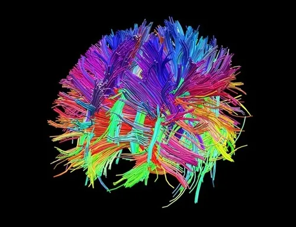
    

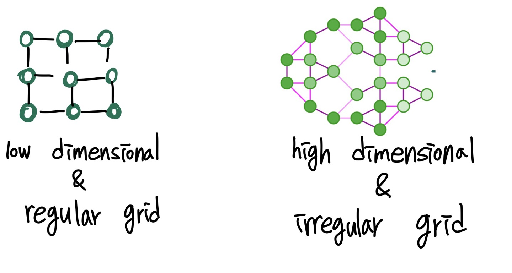

저차원 & 규칙적인 grid(Euclidean Domains)에서 그래프(특히, Non-Euclidean domain)로 CNN을 일반화할 때 발생가능한 문제는 Localization 문제입니다. 하지만 본 논문에서는 이를 해결하면서 계산복잡도까지 감소시켜 효율적인 방법을 제시합니다.

- Localization
    
    이미지 안에 물체들이 어디에 있는지를 찾아내는 문제. 물체가 있는 곳에 bounding box를 그리는 방식으로 표시합니다.
    
    
    

# Proposed Technique

비 유클리디안 도메인 데이터에서 “Convolution theorem”을 활용해 CNN을 진행합니다. 비유클리디안 도메인에서 명시적으로 cnn을 진행하지 않고, 푸리에 도메인으로 필터와 그래프 데이터를 변경하고, element-wise 곱을 통해 푸리에 역 변환을 수행하면서 공간학적 도메인으로 변환시킵니다.

즉, non-euclidean input(Spatial domain) → Fourier domain  → element-wise multiplication → inverse Fourier transform (Spatial domain) → Convolved signal

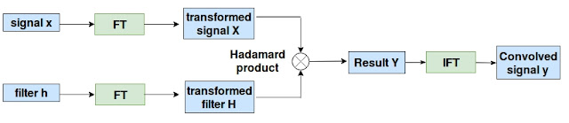

- 여기서 FT는 푸리에 변환을 의미하며, IFT는 역변환된 푸리에 변환을 의미합니다.
- 푸리에 변환 (Fourier Transform)
    
    직관적으로 설명하자면, 임의의 입력 신호를 다양한 주파수를 갖는 주기함수들의 합으로 분해하여 표현하는 것입니다.  
    
    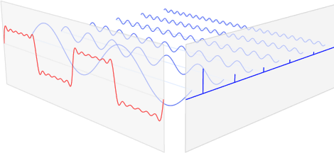
    
    위 그림에서, 맨 앞의 붉은색 신호는 입력신호이고, 뒤의 파란색 신호들은 푸리에 변환을 통해 얻어진 주기함수 성분들입니다. 주기함수들을 모두 합치면 붉은 색의 원본 신호가 됩니다. 자세한 수식 내용은 뒤에 이어서 설명하겠습니다.
    

### Graph Fourier Transform

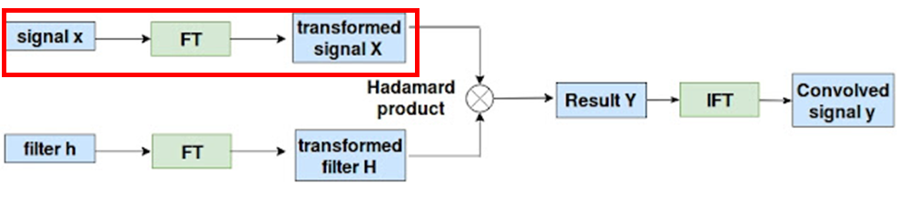

그래프의 푸리에 분석에서 사용되는 중요한 연산자는 Laplacian 연산입니다. (앞선 포스팅, GCN 기초편에서 라플라시안 연산에 대해 자세히 나와있습니다.) Laplacian 연산을 보면, n크기를 갖는 V벡터(노드)와 엣지E를 갖는  $G=(V,E)$로 구성된 그래프에서 라플라시안은 다음과 같이 정의됩니다.

$\Delta = D-A$ 

이때, D는 diagonal degree matrix 이고, A는 그래프에서 인접행렬입니다. 

라플라시안 행렬에서 eigen-decomposition(고유값 분해)를 할 때 얻은 고유벡터를 $\{\phi_l\}_{l=0}^{n}$로 정의하고 Fourier modes라고 불립니다. 고유값은 $\{\lambda_l\}_{l=0}^{n}$이라고 정의되며 그래프의 주파수의 역할을 합니다.

- 고유값 분해
    
    행과 열의 개수가 같은 행렬 A에 대해 어떠한 선형변환했을 때, 크기만 변하고 방향이 변하지 않는 벡터를 찾는 것입니다.
    
    그림을 통해 보자면, 
    
    *그림 1* 
    
    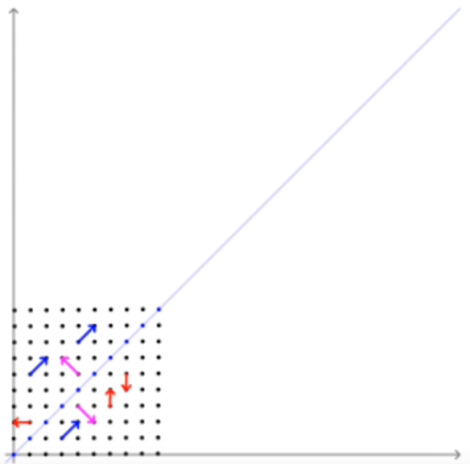
    
    *그림 2*
    
    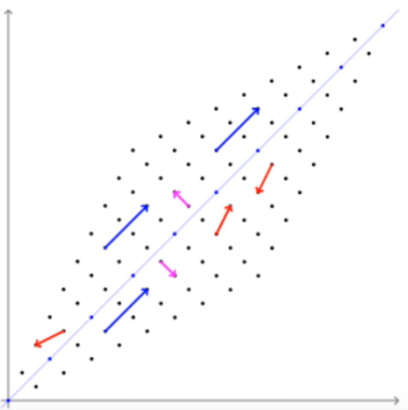
    
    그림 1에는 빨간색 벡터, 파란색 벡터, 분홍색 벡터가 있습니다. 그리고, 그림 2는 그림1을 선형변환한 figure입니다. 빨간색 벡터는 선형변환 전(그림1)에서와 선형 변환 후(그림2)에서의 방향이 바뀌어서 고유벡터가 될 수 없습니다. 하지만 파란색과 분홍색 벡터는 선형변환 전과 후 모두 같은 방향을 가지고 있고 크기만 변화하였습니다. 따라서, 파란색 벡터와 분홍색 벡터는 각각 고유벡터(eigen-vector)라고 하며, 벡터의 크기변화는 고유값(eigen-value)라고 합니다. 
    
    **즉, 그림1에서 대각선 방향으로 쭈욱 늘렸는데도 방향이 변하지 않는 벡터를 찾는 것입니다!**
    
    이를 수식으로 쓰면 다음과 같습니다.
    
    $Av=\lambda v$ 
    
    - v는 열벡터로 정의되고 고유벡터이며, $\lambda$는 상수값을 갖는 고유값입니다.
    

푸리에 급수에 의해 라플라시안은 다음과 같이 쓸 수 있습니다.

$\Delta = \Phi \Lambda \Phi^T$

이 때, $\Phi = \{\phi_l\}_{l=0}^{n}$인 고유 벡터(열벡터) 입니다. 또한, $\Lambda = \{\lambda_l\}_{l=0}^{n}$인 고유값(대각행렬)입니다. (*대각행렬 : 행과 열이 동일한 원소에만 값이 있고 나머지의 원소 값은 0인 행렬)

이제, 그래프에 푸리에 급수를 곱하는 것만으로도 푸리에 도에민으로 변환할 수 있습니다. 따라서 그래프의 푸리에 변환은 다음과 같습니다.

그래프 $x\in \mathbb{R}^n$의 노드에서 정의되는 신호 $x: V \rightarrow \mathbb{R}$ 에서의 그래프 푸리에 변환

: $\hat{x} = \Phi^T x$

따라서, 그래프 신호를 푸리에 도메인으로 변환하는 작업은 벡터 연산 곱에 불과하게 됩니다.

비슷하게, 역변환된 그래프 푸리에 변환은 $x=\Phi \hat{x}$와 같습니다.

### Spectral Convolution Operation

non-Euclidean domain에서 합성곱을 정의하는 2가지 스텝이 있습니다.

1. 그래프를 푸리에 변환 하기
2. 푸리에 도메인의 합성곱으로 그래프 신호 f와 필터 g사이의 합성곱 연산
    
    $f*g = \Phi g(\Lambda) \Phi^Tf$
    
    여기서 $g(\Lambda)$는 스펙트럼 필터의 coefficient입니다.
    

그러나, 여기에는 한계점이 있습니다.

1) 필터가 non-parametric 합니다. 즉, 학습을 위한 필터 파라미터의 수가 계산복잡도 O(n)을 의미하는 입력값의 차원에 의존적입니다. → 즉 계산하는데 오래걸립니다.

2)  컴퓨터 비전에서 주변 로컬필셀들만 필요한 전통적인 CNN과는 다르게 그래프에서 학습되는 필터들은 전체 그래프를 고려합니다.

3) 알고리즘은 고유값 분해를 명확하게 계산해야하고, 푸리에 급수와 신호를 곱하기 때문에 계산량은 $O(n^2)$이 됩니다. → 즉, 계산하는데 오래 걸립니다.

이러한 한계는 고정된 수 K의 다항식으로 Spectral filter를 근사시키면서 극복할 수 있습니다.

(그래프를 다양한 수학적 계산을 통해 지지고 볶고 하는 것이 너무 계산량 많으니까 그냥 **필터를 근사시켜서 계산하자!**라고 이해했습니다...)

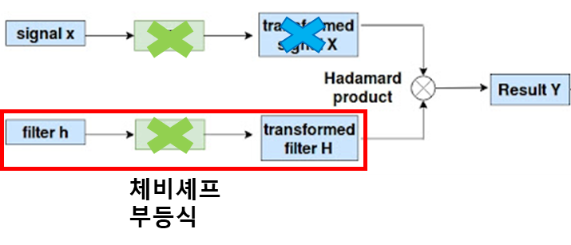

즉, 우리는 필터를 모수화 시켜 $g_\theta(\Lambda)$라고 쓸 수 있습니다. 단, $\Theta \in \mathbb{R}^K$는 다항식 계수 벡터입니다.

Graph Signal Processing에서 다항식을 커널에 근사하기 위해 사용되는 전통적인 식은 체비셰프 다항식입니다.

Spectral filter는 체비세프 식을 사용해 다음과 같이 정의합니다.

$g_\theta (\tilde{\Delta}) = \Phi g(\Lambda)\Phi^T = \sum_{k=0}^K\theta_k T_k(\tilde{\Lambda})$

따라서 푸리에 급수 행렬이 필요 없기 때문에 계산량이 큰 고유값 분해를 수행할 필요가 없습니다. 이 방법은 라플라시안 행렬만 저장하면 되기 때문에 계산량이 크게 감소합니다.

### Pooling Operation on graphs

이미지의 경우, 풀링 연산은 픽셀의 고정된 크기 패치(ex. 2*2)를 얻어 최대값의 픽셀만 유지하고(max-poolilng을 진행할 때) 나머지 픽셀은 버립니다. 이와 유사한 방법을 그래프에 적용할 수 있습니다.

그래프에서 풀링 연산은 비슷한 노드를 그룹핑하고 각 그룹에서 몇개의 노드만을 유지하면서 진행됩니다. 이것을 여러번 반복하는 것은 그래프 구조를 유지하면서 multi-scaling clustering하는 것과 동일합니다. 

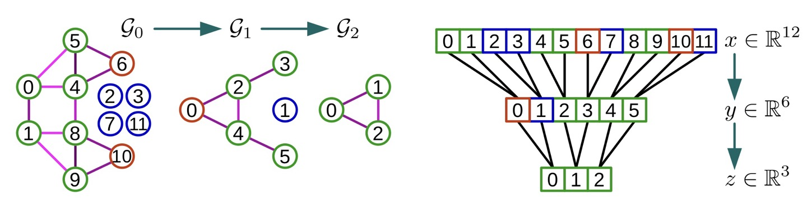

*figure 2. Example of Graph Coarsening and Pooling*

그래프 풀링을 효과적으로 수행하기 위해서는 2단계로 진행됩니다.

1) balanced binary tree 생성

2) 노드 재정렬

그림은 size 4 pooling의 예시입니다. 그래프의 크기를 반으로 줄이기 때문에 size4 pooling은 size 2 pooling을 2번 하는 것으로 표현할 수 있습니다. 

pooling 시 노드는 singleton(빨강), fake(파랑), regular(초록)노드로 3종류가 있는데, 초기 그래프 g0은 파란색 fake 노드를 제외한 나머지 노드 8개로 구성된 그래프 입니다. 

이를 balanced binary tree로 생성하면 level 0는 노드 12개, level1은 6개, level2는 3개가 됩니다. 이제, 가장 낮은 레벨에서부터 압축 후 재정렬을 해보겠습니다. match가 안된 노드들은 빨간색의 singleton이 되는데, singleton은 항상 가상의 fake노드와 짝이 되는 것을 알 수 있습니다.

- match
    
    저는 이해 못했습니다.
    
    [https://www.tutorialspoint.com/graph_theory/graph_theory_matchings.htm](https://www.tutorialspoint.com/graph_theory/graph_theory_matchings.htm)
    

# Experiments

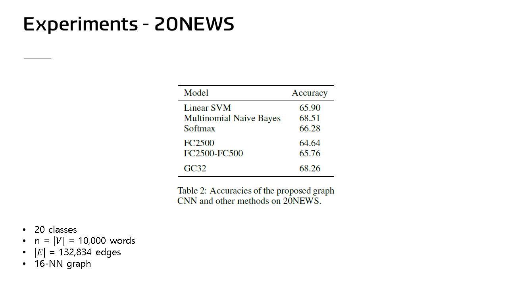

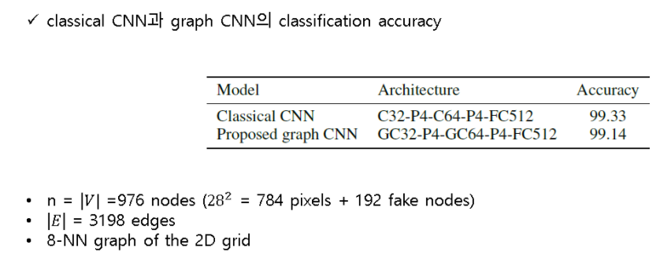

# Conclusion

- Localized filter : non-Euclidean데이터에서 합성곱 진행가능
- low computational complexity
- Spectral formulation
- Efficient pooling
- Experimental result

ref)

[https://technical-support.tistory.com/56](https://technical-support.tistory.com/56)

[https://en.wikipedia.org/wiki/Connectome](https://en.wikipedia.org/wiki/Connectome)

[https://en.wikipedia.org/wiki/Convolution_theorem](https://en.wikipedia.org/wiki/Convolution_theorem)

[https://darkpgmr.tistory.com/171](https://darkpgmr.tistory.com/171)

[http://cnnforgraphs.blogspot.com/2018/03/paper-summary-2-convolutional-neural.html](http://cnnforgraphs.blogspot.com/2018/03/paper-summary-2-convolutional-neural.html)

[https://hannah37.github.io/graph convolutional network/2020/08/06/Convolutional-Neural-Networks-on-Graphs-with-Fast-Localized-Spectral-Filtering/](https://hannah37.github.io/graph%20convolutional%20network/2020/08/06/Convolutional-Neural-Networks-on-Graphs-with-Fast-Localized-Spectral-Filtering/)

[https://www.tutorialspoint.com/graph_theory/graph_theory_matchings.htm](https://www.tutorialspoint.com/graph_theory/graph_theory_matchings.htm)

[https://bkshin.tistory.com/entry/머신러닝-19-행렬](https://bkshin.tistory.com/entry/%EB%A8%B8%EC%8B%A0%EB%9F%AC%EB%8B%9D-19-%ED%96%89%EB%A0%AC)
